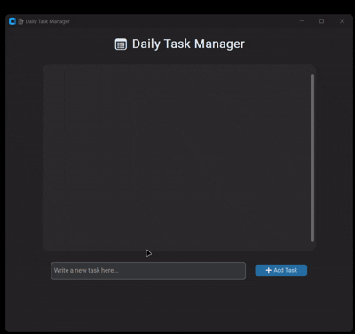

# ✅ Daily Task Manager (Todo App)

A modern and responsive task manager built with **CustomTkinter** that allows you to:

- ➕ Add new tasks
- ✅ Mark tasks as completed
- ❌ Delete tasks
- 💾 Save and load tasks automatically via JSON



Perfect for daily routines, simple projects, or productivity tracking!

---

## 🚀 Features

| Feature           | Description                                                                 |
|------------------|-----------------------------------------------------------------------------|
| 🖥️ GUI Based      | Beautiful and minimal interface built with `CustomTkinter`                  |
| ➕ Add Tasks       | Enter your tasks easily with input field and "Add Task" button              |
| ✅ Toggle Tasks    | Check/uncheck tasks to mark as complete                                     |
| ❌ Delete Tasks    | Instantly remove tasks with the delete button                               |
| 💾 Auto Save       | Tasks are saved to a local `tasks.json` file for persistence               |
| 📜 Scrollable UI   | View long lists easily using a scrollable area                              |
| 🌗 Dark Theme      | Uses `dark` appearance mode for a sleek, modern look                        |

---

## 🧠 How It Works (Algorithm Behind the Scenes)

### 1. 📥 Load Tasks (on startup)
```python
with open(TASKS_FILE, "r") as f:
    tasks = json.load(f)
```
- Safely loads tasks from `tasks.json` if it exists
- Handles invalid JSON with a fallback to empty list

### 2. ➕ Adding a Task
```python
tasks.append({"text": task_text, "completed": False})
```
- Captures input from the `CTkEntry`
- Creates a task dictionary with `text` and `completed` fields
- Updates both UI and local data structure

### 3. ✅ Marking Completion
```python
tasks[task_id]["completed"] = not tasks[task_id]["completed"]
```
- Each task has a checkbox to toggle its `completed` status
- Appearance (text color + strike-through) updates accordingly

### 4. ❌ Deleting a Task
```python
tasks.pop(task_id)
```
- Removes task from list and UI
- Rebuilds task list to update indexes and button callbacks

### 5. 💾 Saving Tasks
```python
json.dump(tasks, f, indent=2)
```
- All changes (add/delete/toggle) are saved back into `tasks.json`

---

## 🖼️ UI Preview (Structure Overview)
```
+--------------------------+
|     Daily Task App       |
+--------------------------+
|  [ Task List (scroll) ]  |
|  [  Check | Text | ❌ ]  |
|  [  Check | Text | ❌ ]  |
|        ...               |
+--------------------------+
|  [ Entry Field        ]  |
|  [         ➕ Add Task ]  |
+--------------------------+
```

---

## 🗃️ Project Structure

```
todo_app/
├── main.py            # Main application file
├── tasks.json         # Saved tasks (auto-generated)
├── README.md          # Project documentation
├── requirements.txt   # Dependency list
```

---

## 📦 Requirements

### 🔧 Python Packages
```txt
customtkinter==5.2.1
```
Install with:
```bash
pip install -r requirements.txt
```

---

## 🛠️ Setup & Run
```bash
git clone https://github.com/your-username/daily-task-manager.git
cd daily-task-manager
python main.py
```

---

## 🧩 Future Ideas
- 📆 Due dates & reminders
- ☁️ Cloud sync
- 🌓 Light/Dark mode toggle
- 🗂️ Task categories / tags
- 🔔 Desktop notifications

---

## 📜 License
MIT License

