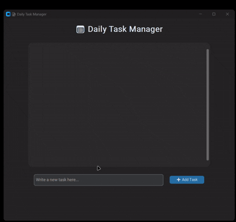

# ✅ Daily Task Manager

A professional, refactored task manager built with **CustomTkinter**.



## 🚀 Features

- ➕ **Add Tasks**: Easily enter new tasks.
- ✅ **Toggle Tasks**: Mark tasks as completed with a visual strike-through.
- ❌ **Delete Tasks**: Remove tasks instantly.
- 💾 **Persistence**: Automatic saving to `tasks.json`.
- 🏗️ **Clean Architecture**: Implemented with Repository and Service patterns.
- 🧪 **Tested**: Unit tests included.

## 📦 Installation

```bash
pip install .
```

Or for development:

```bash
pip install -e .
```

## 🛠️ Usage

Run the application:

```bash
python -m task_manager
```

Or if installed as a package:

```bash
task-manager
```

## 🏗️ Project Structure

- `src/task_manager/api/`: GUI implementation (Facade for TaskService).
- `src/task_manager/core/`: Business logic and service orchestration.
- `src/task_manager/infra/`: Persistence logic (Strategy pattern via BaseRepository).
- `src/task_manager/models/`: Data models and object creation (Factory pattern).
- `tests/`: Comprehensive unit and integration tests.

## 🧪 Testing

Run tests with `pytest`:

```bash
pytest
```

## 🌗 Features

- Modern Dark Theme.
- Responsive design with scrollable task list.
